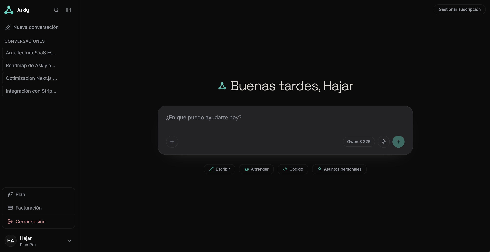
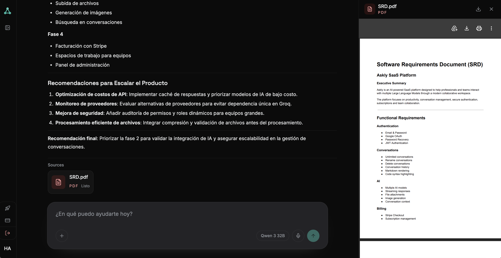
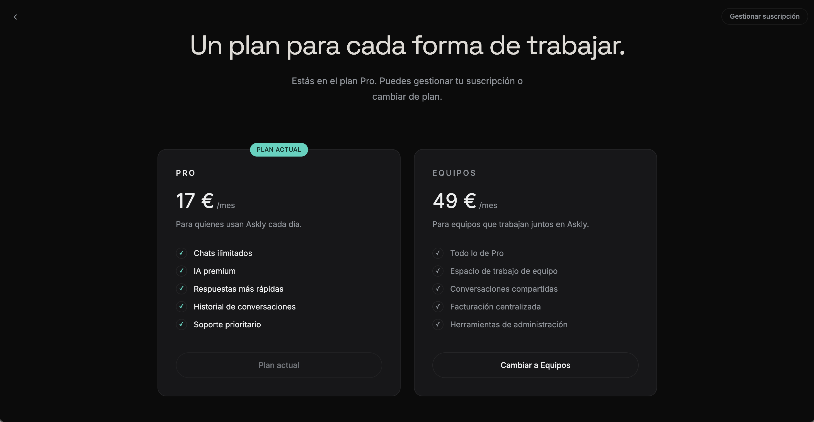
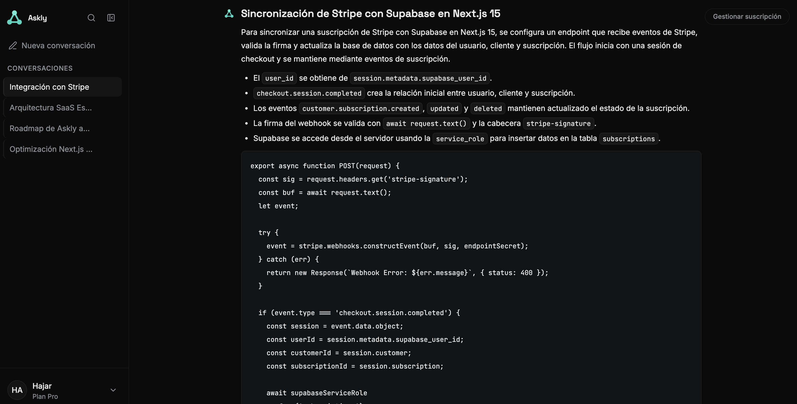

# 💬 Askly

Askly es un proyecto personal desarrollado con Next.js, Supabase, Groq y Stripe como parte de mi proceso de aprendizaje continuo en desarrollo Full Stack.

El objetivo del proyecto ha sido construir una aplicación moderna inspirada en asistentes conversacionales con IA, incorporando funcionalidades como autenticación, historial persistente, análisis de documentos PDF y gestión de suscripciones para seguir profundizando en tecnologías y arquitecturas utilizadas en aplicaciones reales.


---

## Vista previa



---

## Características

### Inteligencia Artificial

- Conversaciones con IA mediante **Groq**.
- Respuestas en **streaming** utilizando **Server-Sent Events (SSE)**.
- Integración con el modelo **Qwen 3 32B**.
- Historial persistente de conversaciones.
- Creación automática de títulos para cada conversación.
- Renderizado de respuestas en Markdown.
- Bloques de código con formato monoespaciado y estilo diferenciado.
- Transcripción de voz a texto mediante Whisper (Groq) para dictar mensajes.

---

### Gestión de documentos

- Subida de PDFs y archivos de texto o código como adjuntos (hasta 5 por mensaje).
- Extracción automática del contenido.
- Uso del contenido extraído como contexto para la respuesta de la IA.
- Visor de PDF integrado, con descarga mediante enlace firmado.

---

### Autenticación

- Registro e inicio de sesión mediante **Supabase Auth**.
- Inicio de sesión seguro.
- Cierre de sesión.
- Registro con selector internacional de teléfono.
- Redirección a inicio de sesión al intentar abrir una conversación sin sesión activa.

---

### Conversaciones

- Historial persistente.
- Renombrado y eliminación de conversaciones.
- Búsqueda dentro del historial de conversaciones.
- Persistencia de mensajes en PostgreSQL.
- Recuperación automática del historial.
- Organización mediante sidebar.

---

### Suscripciones

- Stripe Checkout.
- Stripe Billing Portal.
- Planes Free, Pro y Team.
- Sincronización automática mediante Webhooks.
- Actualización en tiempo real utilizando Supabase Realtime.
- Polling como mecanismo de respaldo cuando Realtime no está disponible.

---

### Seguridad

- Validación del usuario mediante Bearer Token en las rutas de la API que acceden a datos de usuario.
- Row Level Security (RLS) en Supabase.
- Límite diario del plan Free calculado exclusivamente en servidor.

---

### Experiencia de usuario

- Diseño responsive.
- Interfaz inspirada en Claude.
- Navegación fluida.
- Gestión automática del estado de la suscripción.
- Feedback visual durante las respuestas en streaming.

---

## Tecnologías

| Tecnología | Uso |
|------------|-----|
| **Next.js 16 (App Router)** | Framework principal y Route Handlers |
| **React 19** | Construcción de la interfaz |
| **Tailwind CSS 4** | Sistema de estilos |
| **Supabase** | Autenticación, PostgreSQL, Row Level Security, Storage y Realtime |
| **Groq API** | Generación de respuestas de IA (Qwen 3 32B) y transcripción de voz (Whisper) |
| **Stripe** | Checkout, Billing Portal, suscripciones y Webhooks |
| **unpdf** | Extracción de texto de archivos PDF en el servidor |
| **lucide-react** | Iconografía |
| **react-phone-input-2** | Selector internacional de teléfono |

---

## Primeros pasos

### 1. Clonar el repositorio

```bash
git clone https://github.com/hjr-dev/Askly.git

cd Askly

npm install
```

---

### 2. Variables de entorno

Copia el archivo `.env.example` a `.env.local` y completa los valores correspondientes.

```bash
cp .env.example .env.local
```

```env
# Supabase
NEXT_PUBLIC_SUPABASE_URL=
NEXT_PUBLIC_SUPABASE_ANON_KEY=
SUPABASE_SERVICE_ROLE_KEY=

# Stripe
STRIPE_SECRET_KEY=
STRIPE_WEBHOOK_SECRET=
NEXT_PUBLIC_STRIPE_PRO_PRICE_ID=
NEXT_PUBLIC_STRIPE_TEAM_PRICE_ID=

# Groq
GROQ_API_KEY=
```

---

### 3. Base de datos

Ejecuta los siguientes scripts SQL en el **SQL Editor** de Supabase respetando este orden:

```text
supabase/subscriptions.sql

supabase/conversations.sql

supabase/attachments.sql
```

Estos scripts crean toda la estructura necesaria para la aplicación:

- tabla `subscriptions`
- tabla `conversations`
- tabla `messages`
- tabla `message_attachments`, junto con el bucket privado `message-attachments` en Supabase Storage
- políticas **Row Level Security** para cada usuario
- índices para optimizar las consultas
- relación entre conversaciones, mensajes y adjuntos mediante **ON DELETE CASCADE**

Gracias a esta relación, al eliminar una conversación también se eliminan automáticamente todos sus mensajes y adjuntos asociados.

---

### 4. Configuración de Stripe

Askly utiliza Stripe para gestionar:

- Stripe Checkout
- Billing Portal
- Suscripciones
- Webhooks
- Sincronización del estado de los planes

Durante el desarrollo es necesario exponer el servidor local mediante una URL pública para que Stripe pueda enviar correctamente los eventos del webhook.

---

### 5. Configuración de ngrok

Inicia el túnel hacia tu servidor local:

```bash
ngrok http 3000
```

Obtendrás una URL similar a:

```text
https://xxxxxxxx.ngrok-free.dev
```

Después:

1. Accede al Dashboard de Stripe.
2. Ve a **Developers → Webhooks**.
3. Crea un nuevo endpoint apuntando a:

```text
https://xxxxxxxx.ngrok-free.dev/api/stripe/webhook
```

4. Copia el valor `whsec_...` generado por Stripe.
5. Guárdalo en:

```env
STRIPE_WEBHOOK_SECRET=
```

#### ¿Por qué utilizar ngrok?

En este proyecto se utiliza **ngrok** en lugar de `stripe listen` porque permite trabajar exactamente igual que en producción.

Ventajas:

- Stripe envía eventos a un endpoint real.
- Se prueba el mismo flujo utilizado en producción.
- Es posible probar Checkout y los redireccionamientos completos.
- La aplicación puede abrirse desde otros dispositivos durante el desarrollo.
- El inspector de ngrok (`http://127.0.0.1:4040`) facilita la depuración de cada petición recibida.

Como contrapartida, la URL cambia cada vez que se reinicia ngrok (plan gratuito), por lo que es necesario actualizar el endpoint en Stripe y el valor de `STRIPE_WEBHOOK_SECRET`.

---

### 6. Ejecutar el proyecto

Servidor de desarrollo:

```bash
npm run dev
```

La aplicación estará disponible en:

```text
http://localhost:3000
```

---

### 7. Build de producción

Generar la versión de producción:

```bash
npm run build
```

Iniciar el servidor de producción:

```bash
npm run start
```

---

### 8. Lint

Antes de desplegar la aplicación es recomendable comprobar que el proyecto no contiene errores de lint.

```bash
npm run lint
```

Los comandos `npm run lint` y `npm run build` deberían completarse sin errores antes de realizar cualquier despliegue.

---

## Arquitectura del proyecto

Askly está construido siguiendo una arquitectura modular basada en **Next.js App Router**, donde cada responsabilidad se encuentra claramente separada entre la interfaz, la lógica de negocio y los servicios externos utilizados por la aplicación.

La aplicación se organiza alrededor de cinco pilares principales:

- **Autenticación y autorización**
- **Conversaciones con IA**
- **Análisis de documentos**
- **Gestión de suscripciones**
- **Sincronización en tiempo real**

Esta separación facilita el mantenimiento del código y la reutilización de lógica entre rutas a medida que el proyecto crece.

---

## Estructura del proyecto

```text
askly/
├── src/
│
├── app/
│   ├── api/
│   │   ├── attachments/
│   │   ├── audio/
│   │   ├── conversations/
│   │   ├── stripe/
│   │   └── subscription/
│   │
│   ├── chat/
│   ├── login/
│   ├── register/
│   ├── pricing/
│   ├── components/
│   ├── hooks/
│   ├── lib/
│   ├── layout.jsx
│   └── page.jsx
│
├── supabase/
│   ├── conversations.sql
│   ├── subscriptions.sql
│   └── attachments.sql
│
└── public/
```

---

## Sistema de conversaciones

Las conversaciones se almacenan de forma persistente en **Supabase PostgreSQL**, permitiendo que cada usuario mantenga su historial incluso después de cerrar sesión.

La base de datos se estructura principalmente en cuatro tablas:

- `subscriptions`
- `conversations`
- `messages`
- `message_attachments`

Cada conversación pertenece a un único usuario y cada mensaje queda asociado a su conversación correspondiente mediante claves foráneas.

La relación entre `messages`, `conversations` y `message_attachments` utiliza **ON DELETE CASCADE**, de modo que al eliminar una conversación también se eliminan automáticamente todos sus mensajes y adjuntos.

El historial se muestra en el sidebar y permite:

- crear nuevas conversaciones
- recuperar conversaciones anteriores
- renombrar y eliminar conversaciones
- buscar dentro del historial
- mantener el contexto entre sesiones

Las operaciones de borrado y renombrado están protegidas mediante autenticación y solo pueden realizarse sobre conversaciones pertenecientes al usuario autenticado.

---

## Análisis de documentos

Askly permite adjuntar documentos PDF y archivos de texto o código (por ejemplo `.txt`, `.md`, `.json`, `.csv` o archivos fuente) para utilizarlos como contexto durante la conversación con la IA.

El flujo general es el siguiente:

1. El usuario adjunta hasta 5 archivos en un mismo mensaje (PDF de hasta 5 MB, otros archivos de hasta 1 MB).
2. El servidor extrae el texto: los PDF se procesan con **unpdf**, el resto de archivos se lee directamente como texto.
3. El archivo original se guarda en un bucket privado de Supabase Storage y queda asociado al mensaje en la tabla `message_attachments`.
4. El texto extraído se incorpora al contexto enviado al modelo, con un aviso para que la IA lo trate como material de referencia y no como instrucciones.
5. Groq genera una respuesta teniendo en cuenta tanto la conversación como el contenido del documento, y la respuesta se transmite al cliente en streaming.

Los PDF sin texto seleccionable (por ejemplo, documentos escaneados) se rechazan con un aviso, ya que Askly no incluye reconocimiento óptico de caracteres (OCR). Los archivos adjuntos pueden reabrirse después mediante un visor de PDF integrado, que solicita una URL firmada y temporal al servidor.

### Vista del análisis



Esta funcionalidad permite realizar preguntas sobre documentos sin necesidad de copiar manualmente su contenido dentro del chat.

---

## Transcripción de voz

El composer incluye un botón de grabación que captura audio desde el navegador mediante `MediaRecorder`.

Al detener la grabación, el audio se envía a `/api/audio/transcribe`, donde el servidor lo transcribe con el modelo **Whisper Large v3 Turbo** de Groq y devuelve el texto resultante. El texto se añade al campo de escritura para que el usuario lo revise antes de enviarlo; el audio no se almacena ni se envía automáticamente como mensaje.

---

## Planes y suscripciones

Askly utiliza **Stripe** para gestionar pagos y suscripciones.

Actualmente existen tres planes:

| Plan | Mensajes diarios | Descripción |
|------|------------------|-------------|
| **Free** | 20 | Acceso gratuito con límite diario |
| **Pro** | Ilimitados | Suscripción individual |
| **Team** | Ilimitados | Suscripción para equipos |

El límite del plan Free nunca se calcula en el cliente.

Cada petición consulta directamente la base de datos para determinar el número real de mensajes enviados durante el día, evitando cualquier manipulación desde el navegador.

---

### Flujo de suscripción

```text
Pricing
      │
      ▼
Stripe Checkout
      │
      ▼
Stripe Webhook
      │
      ▼
Supabase
(subscriptions)
      │
      ▼
Supabase Realtime
      │
      ▼
useSubscription()
      │
      ▼
Interfaz actualizada
```

Cuando un usuario completa un pago:

1. Stripe envía un Webhook.
2. El servidor actualiza la tabla `subscriptions`.
3. Supabase Realtime detecta el cambio.
4. El cliente actualiza automáticamente el plan activo.
5. La interfaz refleja el nuevo estado sin necesidad de recargar la página.

Como mecanismo de respaldo, la aplicación consulta el estado cada 60 segundos (con la pestaña visible) para cubrir los casos en los que Realtime no puede sincronizar inmediatamente los cambios.

---

### Planes y gestión de suscripciones



---

## Modelo de IA

Askly utiliza **Qwen 3 32B** mediante la API de **Groq**.

La aplicación actúa como intermediaria entre el cliente y el modelo de IA.

En lugar de exponer directamente la API de Groq al navegador:

- el cliente envía la petición al servidor
- el servidor valida la autenticación
- construye el contexto de conversación
- solicita la respuesta a Groq
- retransmite el contenido al cliente mediante **Server-Sent Events (SSE)**
- almacena automáticamente la conversación cuando finaliza la generación

Este enfoque permite mantener protegidas las credenciales del proveedor de IA y centralizar toda la lógica relacionada con límites de uso, autenticación y persistencia.

---

### Conversaciones con IA



---

## Decisiones técnicas

Durante el desarrollo de Askly se tomaron varias decisiones con el objetivo de mantener una arquitectura sencilla y fácil de mantener.

---

### Streaming mediante Server-Sent Events

Las respuestas del modelo de IA se envían utilizando **Server-Sent Events (SSE)**.

Este enfoque ofrece varias ventajas para una aplicación de conversación:

- menor complejidad que una conexión WebSocket
- comunicación unidireccional, suficiente para respuestas generadas por IA
- integración sencilla con Route Handlers de Next.js
- renderizado progresivo de las respuestas
- menor consumo de recursos

---

### Autenticación con Supabase

Toda la autenticación se gestiona mediante **Supabase Auth**.

El servidor valida la identidad del usuario antes de permitir operaciones como:

- crear conversaciones
- recuperar historial
- eliminar conversaciones
- consultar suscripciones
- generar respuestas mediante IA

Las políticas **Row Level Security (RLS)** garantizan que cada usuario únicamente pueda acceder a sus propios datos.

---

### Persistencia de conversaciones

Cada conversación se almacena automáticamente en PostgreSQL.

Esto permite:

- recuperar el historial completo
- mantener el contexto entre sesiones
- organizar conversaciones en el sidebar
- eliminar conversaciones sin afectar a otras

La persistencia se realiza desde el servidor para mantener la consistencia de los datos.

---

### Gestión de suscripciones

El estado de las suscripciones nunca depende del cliente.

El flujo completo es:

```text
Stripe Checkout
        │
        ▼
Stripe Webhook
        │
        ▼
Supabase
        │
        ▼
Supabase Realtime
        │
        ▼
Actualización automática de la interfaz
```

La información mostrada al usuario siempre proviene de la base de datos, evitando inconsistencias entre Stripe y la interfaz.

---

### Protección del plan gratuito

Los límites diarios del plan Free se validan exclusivamente en el servidor.

El cliente nunca decide:

- cuántos mensajes quedan disponibles
- qué plan tiene el usuario
- cuándo debe bloquearse una petición

Esta lógica evita manipulaciones desde el navegador y centraliza todas las reglas de negocio.

---

## Despliegue

El proyecto puede desplegarse en plataformas compatibles con Next.js por ejemplo, Vercel.

Para ello es necesario configurar las variables de entorno de Supabase, Groq y Stripe en la plataforma de despliegue, y crear un endpoint de Webhook en el Dashboard de Stripe que apunte a la URL de producción (`https://tu-dominio/api/stripe/webhook`), actualizando `STRIPE_WEBHOOK_SECRET` con el valor generado.

---

## ¿Hablamos?

Este proyecto forma parte de mi portfolio personal y refleja mi proceso de aprendizaje continuo en desarrollo Full Stack.

Si tienes algún comentario, sugerencia o simplemente quieres conectar, puedes enviarme un mensaje a través de GitHub.

