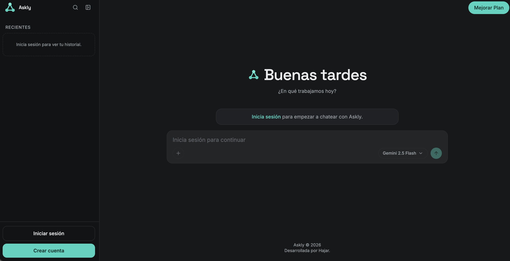
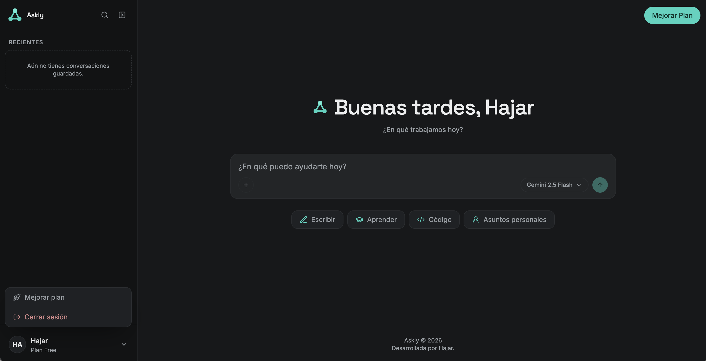
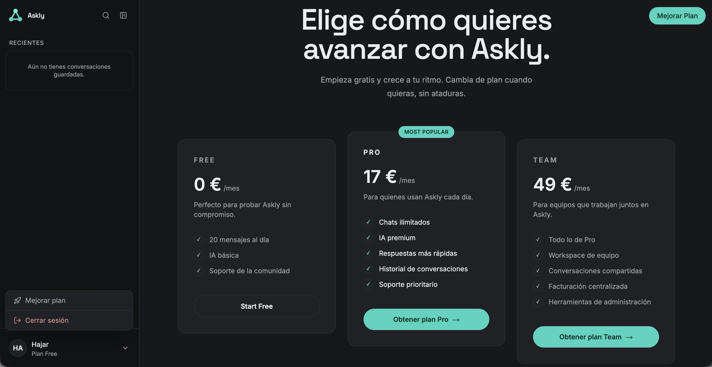
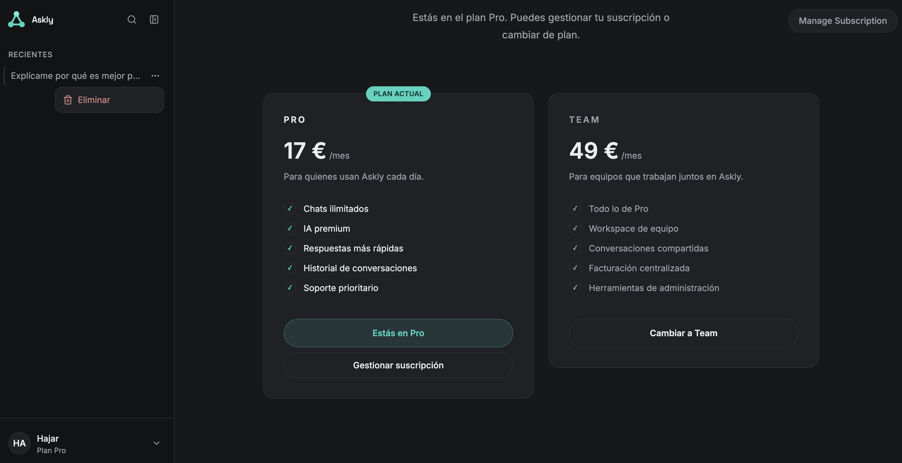

# 💬 Askly

Aplicación de chat con IA desarrollada con Next.js 16, Supabase, Google Gemini y Stripe. El objetivo principal del proyecto fue profundizar en la autenticación con Supabase Auth, la sincronización en tiempo real con Supabase Realtime, la integración de APIs externas y la gestión de suscripciones mediante Stripe.

> 💻 **Repositorio:** https://github.com/Hajarprog/Askly



---

## Características

- Autenticación completa con **Supabase Auth**. (registro, inicio y cierre de sesión).
- Registro con selector de teléfono y país (**react-phone-input-2**).
- Chat con respuestas en streaming mediante **Google Gemini 2.5 Flash**.
- Historial persistente de conversaciones y mensajes almacenado en **Supabase**.
- Eliminación de conversaciones desde el sidebar mediante un menú contextual.
- Sistema de suscripciones con **Stripe Checkout**, **Billing Portal** y **webhooks**.
- Límite diario de mensajes para el plan Free, validado en el servidor.
- Sincronización automática del plan activo mediante **Supabase Realtime** con polling como mecanismo de respaldo.
- API protegida mediante validación del usuario con **Bearer Token**.
- Interfaz inspirada en Claude.
- Diseño responsive para móvil, tablet y escritorio.

---

## Tecnologías

| Tecnología | Uso |
|---|---|
| Next.js 16 App Router | Framework principal y Route Handlers |
| React 19 | UI |
| Tailwind CSS 4 | Estilos |
| Supabase | Auth, Postgres, RLS y Realtime |
| Stripe | Checkout, Billing Portal, suscripciones y webhooks |
| Google Gemini API | Respuestas del asistente en streaming |
| lucide-react | Iconos |
| react-phone-input-2 | Selector de teléfono y país en el registro |

---

## Primeros pasos

### 1. Clona el repositorio

```bash
git clone https://github.com/Hajarprog/Askly.git
cd Askly
npm install
```

### 2. Variables de entorno

Copia `.env.example` a `.env.local` y rellena los valores:

```bash
cp .env.example .env.local
```

```env
# Supabase
NEXT_PUBLIC_SUPABASE_URL=
NEXT_PUBLIC_SUPABASE_ANON_KEY=
SUPABASE_SERVICE_ROLE_KEY=

# Stripe
STRIPE_SECRET_KEY=
STRIPE_WEBHOOK_SECRET=
NEXT_PUBLIC_STRIPE_PRO_PRICE_ID=
NEXT_PUBLIC_STRIPE_TEAM_PRICE_ID=

# Google Gemini
GEMINI_API_KEY=
```

### 3. Base de datos

Ejecuta en el SQL Editor de Supabase, en orden:

```
supabase/subscriptions.sql
supabase/conversations.sql
```

Esto crea:

- `subscriptions`
- `conversations`
- `messages`
- Row Level Security por usuario en las tres tablas
- índices (`user_id, updated_at` en `conversations`; `conversation_id, created_at` en `messages`)
- relación `messages.conversation_id` con `ON DELETE CASCADE`

Gracias a `ON DELETE CASCADE`, al borrar una conversación se eliminan automáticamente sus mensajes.

### 4. Webhook de Stripe en local

El servidor de desarrollo corre en `localhost:3000`, pero Stripe necesita una URL pública para enviar los eventos del webhook. Este proyecto expone el local con **ngrok** en lugar de `stripe listen`:

```bash
ngrok http 3000
```

Esto da una URL pública tipo `https://<subdominio>.ngrok-free.dev`. Con esa URL:

1. Ve a [Stripe Dashboard → Developers → Webhooks](https://dashboard.stripe.com/webhooks) y añade un endpoint: `https://<subdominio>.ngrok-free.dev/api/stripe/webhook`.
2. Copia el `whsec_...` que Stripe genera para ese endpoint en `STRIPE_WEBHOOK_SECRET`.

**¿Por qué ngrok y no `stripe listen`?** `stripe listen` reenvía los eventos directamente desde la CLI a tu máquina sin pasar por un endpoint real registrado en el Dashboard, así que solo sirve para probar en local y no expone tu app al exterior. Usando ngrok en su lugar:

- Se prueba contra un endpoint de Stripe **real**, configurado igual que en producción (misma ruta del código que valida la firma, mismo flujo).
- La URL pública también sirve para probar Stripe Checkout/redirects, o abrir la app desde el móvil u otro dispositivo en la misma prueba.
- El inspector web de ngrok (`http://127.0.0.1:4040`) permite ver cada request/response entrante en crudo, útil para depurar el payload del webhook.
- No depende de tener la Stripe CLI instalada y autenticada.

La contrapartida: cada vez que reinicias ngrok (plan Free) la URL cambia, así que hay que actualizar el endpoint en el Dashboard y el `STRIPE_WEBHOOK_SECRET` de nuevo.

### 5. Ejecuta el proyecto

```bash
npm run dev
```

Abre [http://localhost:3000](http://localhost:3000).

---

## Arquitectura del proyecto

- **Route Handlers** (`src/app/api/**/route.js`) implementan la API de la aplicación: envío y gestión de conversaciones, integración con Stripe (Checkout, Billing Portal, precios y Webhooks) y consulta del estado de la suscripción.
- **`lib/`** concentra la lógica de negocio reutilizable entre rutas: acceso a Supabase (`conversations.js`, `subscriptions.js`), clientes (`supabase.js` cliente / `supabaseAdmin.js` servidor, `stripe.js`), parseo SSE de Gemini (`sse.js`) y la fuente única de verdad de los planes (`plans.js`).
- **`hooks/`**: `useAskly` gestiona el envío de mensajes y el streaming en el cliente; `useSubscription` mantiene sincronizado el plan activo mediante Supabase Realtime.
- **Autenticación por Bearer token**: el cliente adjunta el `access_token` de la sesión de Supabase en cada llamada a la API (mensajes, borrado de conversación, Stripe); el servidor lo valida con `getUserFromAuthorization()` (`lib/subscriptions.js`), que llama a `supabaseAdmin.auth.getUser(token)` pasando el token explícitamente.
- **Gating de planes real**: el límite diario de mensajes del plan Free se calcula contando mensajes en Postgres (`countTodayUserMessages`), no con un contador de cliente que se resetea al recargar.

---

## Estructura del proyecto

```text
askly/
├── src/app/
│   ├── api/
│   │   ├── conversations/
│   │   │   ├── [id]/route.js                 # DELETE: eliminar conversación
│   │   │   └── messages/route.js             # Envío de mensajes + streaming Gemini
│   │   ├── stripe/checkout/route.js          # Crear sesión de Stripe Checkout
│   │   ├── stripe/portal/route.js            # Abrir Billing Portal
│   │   ├── stripe/prices/route.js            # Precios en vivo desde Stripe
│   │   ├── stripe/webhook/route.js           # Sincroniza suscripciones
│   │   └── subscription/status/route.js      # Estado del plan activo
│   │
│   ├── chat/[id]/page.jsx
│   ├── login/page.jsx
│   ├── register/page.jsx
│   ├── pricing/page.jsx
│   ├── page.jsx
│   ├── layout.jsx
│   │
│   ├── components/
│   │   ├── Sidebar.jsx                       # Historial, menú de usuario, borrar chats
│   │   ├── Composer.jsx
│   │   ├── MessageList.jsx
│   │   ├── ModelDropdown.jsx
│   │   ├── MejorarButton.jsx                 # CTA flotante hacia /pricing
│   │   ├── AuthCard.jsx / AuthInput.jsx / AuthButton.jsx
│   │   ├── Logo.jsx / Footer.jsx
│   │
│   ├── hooks/
│   │   ├── useAskly.js
│   │   └── useSubscription.js
│   │
│   └── lib/
│       ├── supabase.js / supabaseAdmin.js
│       ├── stripe.js
│       ├── plans.js
│       ├── subscriptions.js
│       ├── conversations.js                  # CRUD conversaciones/mensajes
│       └── sse.js
│
└── supabase/
    ├── subscriptions.sql
    └── conversations.sql
```

---

## Conversaciones

Askly guarda las conversaciones en Supabase:

- `conversations`: título, usuario, fechas.
- `messages`: mensajes del usuario y del modelo.

El sidebar muestra las conversaciones recientes y permite eliminarlas desde un menú de tres puntos.

Ruta usada para eliminar:

```
DELETE /api/conversations/[id]
```

El cliente envía el `access_token` de Supabase como Bearer token. El servidor valida el usuario antes de borrar y solo elimina la conversación si pertenece a ese usuario (`user_id` coincide en la query de borrado).

---

## Planes

La definición de planes vive en `src/app/lib/plans.js`.

| Plan | Mensajes/día | Estado |
|------|--------------|--------|
| Free | 20 | Visible antes de pagar |
| Pro | Ilimitados | Plan individual |
| Team | Ilimitados | Plan de equipo |

La página `/pricing` se adapta al plan actual:

- Usuario Free: ve Free, Pro y Team.
- Usuario Pro: ve Pro como plan actual y Team como opción (cambio gestionado desde el Billing Portal).
- Usuario Team: ve Team como plan actual y Pro como alternativa (también desde el portal).
- El plan Free no se muestra como opción cuando el usuario ya tiene una suscripción activa.

### Flujo de pago

```
Pricing / MejorarButton
  → /api/stripe/checkout
  → Stripe Checkout
  → /api/stripe/webhook
  → tabla subscriptions
  → Supabase Realtime
  → useSubscription
  → UI actualizada
```

Para usuarios con suscripción activa, los cambios de plan se gestionan desde el Billing Portal.

---

## Modelo de IA

Askly usa **Gemini 2.5 Flash** mediante `streamGenerateContent` + `alt=sse`. El backend actúa como intermediario entre el cliente y la API de Gemini, reenviando el streaming mediante SSE y almacenando la respuesta completa, una vez finaliza la generación.

---

## Retos y decisiones técnicas

### Autenticación y protección de la API

Se implementó un sistema completo de autenticación mediante Supabase Auth. Todas las operaciones protegidas validan el usuario a partir del `access_token` enviado como Bearer Token antes de acceder a conversaciones, mensajes o suscripciones.

### Streaming de respuestas

La integración con **Google Gemini** se realizó mediante **Server-Sent Events (SSE)**. El backend reenvía el flujo de datos al cliente en tiempo real y almacena la respuesta completa al finalizar la generación.


### Sincronización del estado de la suscripción

Tras un cambio de plan en Stripe, un **Webhook** actualiza la base de datos. La interfaz recibe automáticamente los cambios mediante **Supabase Realtime**, utilizando polling como mecanismo de respaldo cuando es necesario.

### Gestión de planes

El límite diario del plan Free se calcula siempre en el servidor utilizando la base de datos, evitando que pueda manipularse desde el cliente.

---

## Capturas

### Usuario registrado

Después de crear una cuenta, Askly da la bienvenida al usuario mostrando su nombre, el plan activo (Free) y una interfaz lista para iniciar una nueva conversación.




### Planes y suscripciones

Página de planes donde los usuarios Free pueden comparar las opciones disponibles y mejorar a Pro o Team mediante Stripe Checkout.




### Plan Pro activo

Tras completar el pago con Stripe, la aplicación actualiza automáticamente el estado de la suscripción. El usuario ve su plan actual (Pro) y puede gestionarlo o cambiar al plan Team desde el Billing Portal de Stripe.



---

## Créditos

Este proyecto utiliza los siguientes servicios:

- **Google Gemini** — generación de respuestas mediante IA.
- **Supabase** — autenticación, base de datos PostgreSQL y sincronización en tiempo real.
- **Stripe** — gestión de pagos y suscripciones.
- **Lucide** — iconografía.
---

## Desarrollado por Hajar en 2026.
